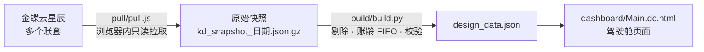

# kingdee-bi-dashboard

基于金蝶云星辰（open.jdy.com 开放平台）的多账套经营驾驶舱：从多个账套只读拉取销售、退货、收款、应收、产品和库存数据，按统一口径加工并校验，生成一个面向管理层的经营驾驶舱。

适合在金蝶云星辰上有多个法人主体、需要剔除集团内部往来、重点看应收账龄和客户经营的分销型企业，例如医美、医疗器械代理商。

## 驾驶舱包含什么

- **页首**：本年累计净销售（与去年同期对比）、回款、回款率、月末应收、逾期率、应收周转天数、成交客户数。
- **经营总览**：近三年逐月销售热力图、三年月度对比、各主体年度结构、渠道结构、大区与部门方块图、业务员排名。
- **应收与账龄**：欠款按账龄色带、逾期最多的客户、逾期按部门（可点击筛选）、账龄 × 逾期交叉矩阵、月末应收余额趋势、未来 12 周到期、客户应收明细。
- **客户经营**：前十大客户及月度走势、新老客户贡献、客户集中度、流失预警（未下单天数 vs 平时下单间隔）。
- **产品与库存**：产品销售排名、品类月均销售、库存可售月数、库存到期分布、批次明细。
- **口径说明**：指标定义、剔除规则、与金蝶报表的核对结果。

所有时间口径（本年 1 月至截止月、去年同期、近 3 个月、近 12 个月）随数据截止日自动变化。

## 整体流程



## 目录

| 路径 | 说明 |
|---|---|
| `pull/pull.js` | 在浏览器里运行的拉数脚本：签名、授权、分页、多账套并行拉取，产出 gzip 快照 |
| `build/build.py` | 从快照生成驾驶舱数据：剔除规则、净销售、回款、FIFO 账龄、客户与产品指标，并做两项核对 |
| `kingdee/kingdee_client.py` | Python 版 API 客户端（签名、授权、token 缓存、安全分页），适合放到服务器上定时运行 |
| `dashboard/Main.dc.html` | 驾驶舱页面（Claude Design 画布格式的单文件组件） |
| `config.example.json` | 配置模板，复制为 `config.json` 后填写 |

## 快速开始

### 1. 准备金蝶开放平台应用

1. 在 [金蝶开放平台](https://open.jdy.com) 创建「第三方企业应用」，得到应用 ID（client_id）和应用 Secret（client_secret）。
2. 为每个账套完成 API 授权，在应用详情页拿到每个账套的实例 ID（outerInstanceId）。
3. 复制 `config.example.json` 为 `config.json`，填入以上信息和你自己的剔除规则。`config.json` 已在 `.gitignore` 中。

### 2. 拉取数据

金蝶业务接口的响应带有重复的 CORS 头，普通网页里的 `fetch` 会被浏览器拦截。`pull.js` 用一个 null 源的沙箱 iframe 转发请求来绕开这个问题，所以要在 `https://open.jdy.com` 页面的开发者工具控制台里运行：

```js
window.KD_CONFIG = { /* 粘贴 config.json 的内容 */ };
// 然后粘贴并执行 pull/pull.js 的全部内容，返回 'started'
JOB.log      // 查看进度，JOB.done 为 true 表示完成
KD_DOWNLOAD() // 下载快照文件
```

数据量较大时（几千张单据、几百个有余额的客户）整个过程需要 10–15 分钟，主要耗时在逐个客户拉应收明细计算账龄。

如果在服务器上运行，没有 CORS 问题，可以用 `kingdee/kingdee_client.py` 按同样的步骤实现。

### 3. 生成驾驶舱数据

```bash
python3 build/build.py kd_snapshot_2026-09-30.json.gz design_data.json config.json
```

脚本会打印核心指标；任一校验不通过就报错退出，不会生成数据：

- 每个账套的 FIFO 账龄明细合计必须等于金蝶应收账款汇总表的期末余额；
- 本年净销售（出库减退货）必须等于金蝶销售汇总表合计。

### 4. 展示

`dashboard/Main.dc.html` 是 Claude Design 画布的单文件组件，页面逻辑在 `<script type="text/x-dc">` 中，用 `fetch('__DATA_URL__')` 读取数据。把 `design_data.json` 上传为画布资源后，将 `__DATA_URL__` 替换为资源地址即可。

如果要在其他环境展示，页面逻辑里的 `renderVals()` 已经把所有指标算成了可直接渲染的数据结构，可以移植到任意前端框架。

## 指标口径

| 指标 | 定义 |
|---|---|
| 净销售 | 已审核销售出库单价税合计 − 已审核销售退货单价税合计，按单据日期归月 |
| 回款 | 应收账款汇总表（`ar_summary_report`）按月的"收销售款"，包含收款单和出库单同单收款 |
| 应收余额 | 应收账款汇总表期末余额（销售应收 + 其他应收） |
| 账龄 | 从出库日起算；客户的收款、退货按先进先出冲销最早的出库单 |
| 到期日 | 出库日 + 客户档案的结算期限；"N天"按天数，"5号前的业务在每月20号结算"按 5 日前出库当月 20 日、之后出库次月 20 日；未设置结算期限的按出库即到期 |
| 应收周转天数 | 期末应收 ÷ 近 3 个月净销售 × 近 3 个月天数 |
| 渠道 | 金蝶客户分类；同一客户在不同账套分类不同时，销售按各账套分类计，客户主渠道取销售额最大的分类 |
| 客户 | 各账套按客户名称合并为集团口径 |
| 新客户 | 首笔出库在本年（受数据起始日限制） |
| 流失预警 | 成交 3 次以上，距上次成交超过平均复购间隔的 1.5 倍且超过 45 天，且在一年以内 |
| 剔除 | 命中 `exclusion_rules` 任一规则的客户，其销售、回款、应收、预收都不计入；金蝶原始数据不修改 |

## 金蝶云星辰 API 踩坑记录

以下问题都在实际对接中遇到过，代码里已经处理。

**鉴权**

- `X-Api-Signature`：签名原文共 5 行，每行都以换行结尾（包括最后的 timestamp 行）；params 要做**两次** URL 编码且编码字母大写；用 clientSecret 做 HMAC-SHA256 后，对**十六进制字符串**再做 Base64，不是对原始字节做 Base64。`kingdee_client.py` 的自检用官方文档的示例签名逐字验证。
- `app_signature`（换取 app-token）：`Base64(hex(HMAC-SHA256(appSecret, appKey)))`。
- appSecret 每 24 小时刷新；app-token 有效期 24 小时；换 token 接口同一参数每分钟最多 2 次。
- 主动获取授权接口（`push_app_authorize`）实际返回 `code/msg`，而文档字段表写的是 `errcode/description`，两种都要兼容。

**分页与数据完整性**

- `page_size` 超过 100 会被静默截断为 100，但 `total_page` 仍按你请求的大小计算，结果会少数据且不报错。固定 `page_size=100`，并核对行数等于 `count`。
- 销售汇总表（`sal_summary_rpt_ims`）只有第 1 页返回正确的 `total_page`，之后每页都返回 1。以第 1 页的页数为准。
- 客户应收统计表（`ar_report`）在不加筛选时最多返回 100 行，`count` 也报 100。改用应收账款汇总表（`ar_summary_report`），它分页正常。
- 销售出库单列表的汇总表头 `headers.total_amount`（价税合计汇总）返回空字符串，要逐单累加。
- 销售退货单列表不返回金额，要逐单调用详情接口取 `total_amount`。
- 客户列表接口默认不返回已禁用客户，但历史单据里会出现这些客户，需要按 ID 调客户详情补齐。
- 出库单列表不带部门字段；按 `dept_id` 筛选可以反查，且上级部门筛选不包含下级部门的单据。

**口径**

- 应收账款明细表（`ar_order_statement_report`）是按客户的流水账，余额为负号口径（客户欠款显示为负数），不是逐单未收余额。账龄要按流水的余额变化做先进先出自行计算。
- 应收账款汇总表的余额是期末余额；按月调用即可得到月末余额和当月回款。

**浏览器环境**

- 业务接口响应的 `Access-Control-Allow-Origin` 头重复，浏览器会拦截。在 null 源的沙箱 iframe（`sandbox="allow-scripts"`）里发起请求可以正常读取。服务端调用没有这个问题。
- 单个接口调用限频 500 次/分钟/账套。

## 安全

- 不要把 `config.json`、快照文件、生成的 `design_data.json` 提交到公开仓库，里面有密钥或客户经营数据。
- 拉数全程只调用查询接口，不写入金蝶。
- 如果 client_secret 曾经出现在聊天记录、截图或代码里，到开放平台重置一次。

## 已知限制

- 数据起始日由 `start_date` 决定，更早的成交不可见，会影响"新客户"和复购间隔的判断。
- 库存货值按本年平均含税售价估算，不是成本。
- 客户按名称跨账套合并，同名不同实体的客户会被合并。
